# C-Projects

## Programs - Phase 1

| **SL NO** | **Question**                                                                                                                                                                                                                                                                                                                                                            | **File**                                                                                                                     |
| --------- | ----------------------------------------------------------------------------------------------------------------------------------------------------------------------------------------------------------------------------------------------------------------------------------------------------------------------------------------------------------------------- | ---------------------------------------------------------------------------------------------------------------------------- |
| 1         | WAP to print 'Hello World'                                                                                                                                                                                                                                                                                                                                              | [hello_world.c](/phase1/hello_world.c)                                                                                       |
| 2         | WAP to read and print integer values                                                                                                                                                                                                                                                                                                                                    | [read_print_int.c](/phase1/read_print_int.c)                                                                                 |
| 3         | WAP to add two integer numbers                                                                                                                                                                                                                                                                                                                                          | [addition.c](/phase1/addition.c)                                                                                             |
| 4         | WAP to print your own name by giving user input                                                                                                                                                                                                                                                                                                                         | [name_user_v1.c](/phase1/name_user_v1.c), [name_user_v2.c](/phase1/name_user_v2.c), [name_user_v3.c](/phase1/name_user_v3.c) |
| 5         | WAP to perform the arithmetic operations ( +, -, \*, /, %) of two integers and display the result.                                                                                                                                                                                                                                                                      | [arithmetic_operations.c](/phase1/arithmetic_operations.c)                                                                   |
| 6         | WAP to convert fahrenheit to centigrade                                                                                                                                                                                                                                                                                                                                 | [temp_conv1.c](/phase1/temp_conv1.c)                                                                                         |
| 7         | WAP to convert centigrade to fahrenheit                                                                                                                                                                                                                                                                                                                                 | [temp_conv2.c](/phase1/temp_conv2.c)                                                                                         |
| 8         | WAP to calculate area of a circle                                                                                                                                                                                                                                                                                                                                       | [area_circle.c](/phase1/area_circle.c)                                                                                       |
| 9         | WAP to calculate area of a triangle                                                                                                                                                                                                                                                                                                                                     | [area_triangle.c](/phase1/area_triangle.c)                                                                                   |
| 10        | WAP to swap two numbers using third variable                                                                                                                                                                                                                                                                                                                            | [swap_third.c](/phase1/swap_third.c)                                                                                         |
| 11        | WAP to swap two numbers without using third variable                                                                                                                                                                                                                                                                                                                    | [swap_nothird.c](/phase1/swap_nothird.c)                                                                                     |
| 12        | Convert seconds to hours, minutes and seconds                                                                                                                                                                                                                                                                                                                           | [time_conv.c](/phase1/time_conv.c)                                                                                           |
| 13        | Convert metres to kilometres and metres                                                                                                                                                                                                                                                                                                                                 | [length_conv.c](/phase1/length_conv.c)                                                                                       |
| 14        | WAP to calculate simple interest                                                                                                                                                                                                                                                                                                                                        | [si.c](/phase1/si.c)                                                                                                         |
| 15        | WAP to calculate area of circle, rectangle and square                                                                                                                                                                                                                                                                                                                   | [area.c](/phase1/area.c)                                                                                                     |
| 16        | WAP to display your name, roll no and branch line wise                                                                                                                                                                                                                                                                                                                  | [name_roll_branch.c](/phase1/name_roll_branch.c)                                                                             |
| 17        | WAP to accept three subject marks and display their average                                                                                                                                                                                                                                                                                                             | [avg.c](/phase1/avg.c)                                                                                                       |
| 18        |                                                                                                                                                                                                                                                                                                                                           | [pattern1.c](/phase1/pattern1.c)                                                                                             |
| 19        | WAP to find maximum and minimum among 4 numbers                                                                                                                                                                                                                                                                                                                         | [max_min_4.c](/phase1/max_min_4.c)                                                                                           |
| 20        | WAP to calculate area of triangle when all three sides are given                                                                                                                                                                                                                                                                                                        | [area_triangle_3.c](/phase1/area_triangle_3.c)                                                                               |
| 21        | WAP to find perimeter of a circle                                                                                                                                                                                                                                                                                                                                       | [perimeter_circle.c](/phase1/perimeter_circle.c)                                                                             |
| 22        | WAP to subtract a number from another number and display its results                                                                                                                                                                                                                                                                                                    | [subtract.c](/phase1/subtract.c)                                                                                             |
| 23        | WAP to display the size and address of int, float, and char variable                                                                                                                                                                                                                                                                                                    | [address.c](/phase1/address.c)                                                                                               |
| 24        | Evaluate: p = ++a + a++ + --a                                                                                                                                                                                                                                                                                                                                           | [unary1.c](/phase1/unary_1.c)                                                                                                |
| 25        | WAP to find the discriminant of the quadratic equation                                                                                                                                                                                                                                                                                                                  | [quadratic.c](/phase1/quadratic.c)                                                                                           |
| 26        | If p(x) = 2x2 - 5x + 1, then find p(2) and p(3)                                                                                                                                                                                                                                                                                                              | [start_func.c](/phase1/start_func.c)                                                                                         |
| 27        | WAP to input 3 digit numbers and display the individual digits                                                                                                                                                                                                                                                                                                          | [digits.c](/phase1/digits.c)                                                                                                 |
| 28        | WAP to add two times in hour minute, & second format entered through the keyboard in the format hh:mm:ss                                                                                                                                                                                                                                                                | [time_add.c](/phase1/time_add.c)                                                                                             |
| 29        | WAP to convert given paisa into its equivalent rupee and paisa as per the following                                                                                                                                                                                                                                                                                     | [pasia_conv.c](/phase1/paisa_conv.c)                                                                                         |
| 30        | WAP to find the average marks of 5 subjects of a student and find the percentage. Assume full marks of each subject is 100                                                                                                                                                                                                                                              | [avg_percent.c](/phase1/avg_percent.c)                                                                                       |
| 31        | WAP to enter the principal, time and rate of interest, then calculate compound interest                                                                                                                                                                                                                                                                                 | [ci.c](/phase1/ci.c)                                                                                                         |
| 32        | WAP to input the basic salary of an employee. From the basic calculate the DA (60% of basic), HRA ( 15% of basic) and Gross salary (Basic + DA + HRA)                                                                                                                                                                                                                   | [salary.c](/phase1/salary.c)                                                                                                 |
| 33        |                                                                                                                                                                                                                                                                                                                                           | [pattern2.c](/phase1/pattern2.c)                                                                                             |
| 34        | WAP to find the volume of a cube where one side is given                                                                                                                                                                                                                                                                                                                | [vol_cube.c](/phase1/vol_cube.c)                                                                                             |
| 35        | WAP to find the surface area of a cuboid where length, breadth and height are given                                                                                                                                                                                                                                                                                     | [sa_cuboid.c](/phase1/sa_cuboid.c)                                                                                           |
| 36        | WAP to input two amount(rupees and paise). Find out the sum of that two amount                                                                                                                                                                                                                                                                                          | [money_add.c](/phase1/money_add.c)                                                                                           |
| 37        | WAP to input two rational number and find out the sum                                                                                                                                                                                                                                                                                                                   | [add_rational.c](/phase1/add_rational.c)                                                                                     |
| 38        | WAP to input a 4 digit number and find out the sum of the digits of that number                                                                                                                                                                                                                                                                                         | [sum_digits.c](/phase1/sum_digits.c)                                                                                         |
| 39        | WAP to determine the roots of a quadratic equation, ax2 + bx + c = 0 using if-else statement                                                                                                                                                                                                                                                                 | [roots_quad.c](/phase1/roots_quad.c)                                                                                         |
| 40        | WAP to read an alphabet from the user and convert it into uppercase if the entered alphabet is in lowercase otherwise display an apppropriate message                                                                                                                                                                                                                   | [lower_upper.c](/phase1/lower_upper.c)                                                                                       |
| 41        | WAP to determine wheather a year entered by the user is a leap year or not                                                                                                                                                                                                                                                                                              | [leap_year.c](/phase1/leap_year.c)                                                                                           |
| 42        | WAP to find the largest among three numbers using ternary operator                                                                                                                                                                                                                                                                                                      | [num_ternary_3.c](/phase1/num_ternary_3.c)                                                                                   |
| 43        | WAP to find the largest among two numbers using ternary operator                                                                                                                                                                                                                                                                                                        | [num_ternary_2.c](/phase1/num_ternary_2.c)                                                                                   |
| 44        | WAP to check wheather a number is odd or even using ternary operator                                                                                                                                                                                                                                                                                                    | [odd_even_ternary.c](/phase1/odd_even_ternary.c)                                                                             |
| 45        | WAP to display the message 'KIIT Silver Jubliee' if the entered year is 2022 otherwise display 'Wrong Input'                                                                                                                                                                                                                                                            | [kiitsilverjubliee.c](/phase1/kiitsilverjubliee.c)                                                                           |
| 46        | WAP to read a character from the user and convert it into lowercase alphabet if the entered character is in uppercase and convert it into uppercase if the entered character is in lowercase, otherwise display as it is.                                                                                                                                               | [lower_upper_viceversa.c](/phase1/lower_upper_viceversa.c)                                                                   |
| 47        | WAP to calculate the electric bill by inputting the previous and present meter reading. (The bill amount for 1st 100 units Rs 1.40 per unit, for next 100 units Rs 2.50 per unit and for rest units Rs 3.20 per unit).                                                                                                                                                  | [electric_bill.c](/phase1/electric_bill.c)                                                                                   |
| 48        | WAP to input any two integers, and provide a menu to the user to select any of the options as add, subtract, multiply, divide and display the result accordingly                                                                                                                                                                                                        | [operator_option.c](/phase1/operator_option.c)                                                                               |
| 49        | WAP to display the grade system of KIIT University based on total marks secured by a student in a semester. Use switch-case statement. Calculate the grade of the student according to the percentage of the mark.                                                                                                                                                      | [grade_switchcase.c](/phase1/grade_switchcase.c)                                                                             |
| 50        | WAP to display the grade system of KIIT University based on total marks secured by a student in a semester. Use else...if ladder statement.                                                                                                                                                                                                                             | [grade_if_else.c](/phase1/grade_if_else.c)                                                                                   |
| 51        | A shopkeeper sells an article for Rs. 10,000. If the rate of tax under GST is 10%, calculate and display the tax and the amount paid by the customer.                                                                                                                                                                                                                   | [shop_gst.c](/phase1/shop_gst.c)                                                                                             |
| 52        | A dealer allows his customer two successive discounts of 20% and 10%. If the article costs Rs. 7200, calculate and display the selling price and the total discount given by the dealer.                                                                                                                                                                                | [SP_discount.c](/phase1/SP_discount.c)                                                                                       |
| 53        | In a competitive examination, there were 150 questions. One candidate got 80% correct and the other candidate 72% correct. WAP to calculate and display the correct answers each candidate got.                                                                                                                                                                         | [marks_competitive.c](/phase1/marks_competitive.c)                                                                           |
| 54        | WAP to accept the diagonal of a square. Find and display the area and perimeter of the square.                                                                                                                                                                                                                                                                          | [area_square_d.c](/phase1/area_square_d.c)                                                                                   |
| 55        | WAP to accept the number of days and display it after converting into number of years, months and days.                                                                                                                                                                                                                                                                 | [convert_days.c](/phase1/convert_days.c)                                                                                     |
| 56        | An employee contributes 12% of salary to the Provident fund. Of the remaining salary, he spends 10% on house rent and 20% on education of the children. Write a program to input salary and calculate: i) The amount deducted as provident fund ii) The amount spent on rent and education                                                                        | [salary_division.c](/phase1/salary_division.c)                                                                               |
| 57        | A two digit number can be obtained by using the expression (10a+b), where a and b are the ten’s and unit’s digits respectively. The number after reversing the digits will be (10b+a). Write a program to input two digits of a number (a and b) and display the result when the sum of number and the reversed number is divided by the difference between its digits. | [reverse_difference.c](/phase1/reverse_difference.c)                                                                         |
| 58        | Assign a number to all 11 cricket players. Display player number who scored century. Display the player number who scored the highest. Without using loop. And use goto and ?.                                                                                                                                                                                          | [cricket.c](/phase1/cricket.c)                                                                                               |
| 59        | Bonus == BONUS*RATE * no. of car sold.  Commission = COMMISSION*RATE * no of cars sold \* price Gross salary = BASE_SALARY + Bonus + Commission  MACROS - #define BASE_SALARY = 10000 #define BONUS_RATE = 3000 #define COMISSION_RATE = 0.02                                                                                                         | [salary_commission.c](/phase1/salary_commission.c)                                                                           |
| 60        | WAP to print Fibonacci Series                                                                                                                                                                                                                                                                                                                                           | [fibonacci.c](/phase1/fibonacci.c)                                                                                           |
| 61        | WAP to input two amount(rupees and paise). Find out the difference of that two amount                                                                                                                                                                                                                                                                                   | [money_sub.c](/phase1/money_sub.c)                                                                                           |
| 62        | WAP to print the natural numbers from 1 to 20                                                                                                                                                                                                                                                                                                                           | [one2twen.c](/phase1/one2twen.c)                                                                                             |
| 63        | WAP to print all numbers within a given range. The range is given by user.                                                                                                                                                                                                                                                                                              | [allnumrange.c](/phase1/allnumrange.c)                                                                                       |
| 64        | WAP to calculate the factorial of a given number                                                                                                                                                                                                                                                                                                                        | [factorial.c](/phase1/factorial.c)                                                                                           |
| 65        | WAP to calculate the sum of digits of a given number                                                                                                                                                                                                                                                                                                                    | [sumodigit.c](/phase1/sumodigit.c)                                                                                           |
| 66        | WAP to find the GCD/HCF and LCM of two given numbers                                                                                                                                                                                                                                                                                                                    | [hcf.c](/phase1/hcf.c)                                                                                                       |
| 67        | WAP to check whether a number n is prime number or not                                                                                                                                                                                                                                                                                                                  | [prime.c](/phase1/prime.c)                                                                                                   |
| 68        | WAP to check whether an input integer is perfect square or not. (not working)                                                                                                                                                                                                                                                                                           | [perfectsquare.c](/phase1/perfectsquare.c)                                                                                   |
| 69        | WAP to sum the following series S=1+(1+2)+(1+2+3)+...+(1+2+3+...+n)                                                                                                                                                                                                                                                                                                     | [sumseries1.c](/phase1/sumseries1.c)                                                                                         |
| 70        |                                                                                                                                                                                                                                                                                                                                           | [pattern3.c](/phase1/pattern3.c)                                                                                             |
| 71        |                                                                                                                                                                                                                                                                                                                                           | [pattern4.c](/phase1/pattern4.c)                                                                                             |
| 72        |                                                                                                                                                                                                                                                                                                                                           | [pattern5.c](/phase1/pattern5.c)                                                                                             |
| 73        |                                                                                                                                                                                                                                                                                                                                           | [pattern6.c](/phase1/pattern6.c)                                                                                             |
| 74        | WAP to generate all the prime numbers between 1 and n, where the value of n is supplied by the user                                                                                                                                                                                                                                                                     | [primen.c](/phase1/primen.c)                                                                                                 |
| 75        | WAP to print all odd and even numbers separately within a given range. The range is input through user                                                                                                                                                                                                                                                                  | [odd_even.c](/phase1/odd_even.c)                                                                                             |
| 76        | WAP to print the series as 1, 2, 3, 4, 5, 6, 7, .........., n                                                                                                                                                                                                                                                                                                           | [seris1.c](/phase1/series1.c)                                                                                                |
| 77        | WAP to print the series as 0, 1, 3, 7, 15, 31, .........., n.                                                                                                                                                                                                                                                                                                           | [series2.c](/phase1/series2.c)                                                                                               |
| 78        | WAP to display the reverse of a number entered through keyboard                                                                                                                                                                                                                                                                                                         | [reverse.c](/phase1/reverse.c)                                                                                               |
| 79        | WAP to check whether a number is palindrome or not                                                                                                                                                                                                                                                                                                                      | [palindrome.c](/phase1/palindrome.c)                                                                                         |
| 80        | WAP to print the multiplication table of an entered number                                                                                                                                                                                                                                                                                                              | [mul_table.c](/phase1/mul_table.c)                                                                                           |
| 81        | WAP to find the sum of the square of first n numbers                                                                                                                                                                                                                                                                                                                    | [square_sum.c](/phase1/square_sum.c)                                                                                         |
| 82        | WAP to check whether an integer number is a Armstrong number or not                                                                                                                                                                                                                                                                                                     | [armstrong.c](/phase1/armstrong.c)                                                                                           |
| 83        | WAP to find x to the power of y where x and y will be entered from the keyboard                                                                                                                                                                                                                                                                                         | [power.c](/phase1/power.c)                                                                                                   |
| 84        |                                                                                                                                                                                                                                                                                                                                           | [pattern7.c](/phase1/pattern7.c)                                                                                             |
| 85        |                                                                                                                                                                                                                                                                                                                                           | [pattern8.c](/phase1/pattern8.c)                                                                                             |
| 86        | WAP to print a number in letters.                                                                                                                                                                                                                                                                                                                                       | [letter2word.c](/phase1/letter2word.c)                                                                                       |
| 87        | WAP to calculate sum of the following series: Sum = x\*1/1! + x\*2/2! + x\*4/4! + x\*6/6! + x\*8/8! + x\*10/10!                                                                                                                                                                                                                                                         | [slumseries2.c](/phase1/sumseries2.c)                                                                                        |
| 88        | WAP to convert a decimal number into its equivalent binary number                                                                                                                                                                                                                                                                                                       | [dec2bin.c](/phase1/dec2bin.c)                                                                                               |
| 89        | WAP to check whether an input integer is strong number or not                                                                                                                                                                                                                                                                                                           | [strong.c](/phase1/strong.c)                                                                                                 |
| 90        | WAP to find out the prime factors of a number entered through keyboard                                                                                                                                                                                                                                                                                                  | [prime_factors.c](/phase1/prime_factors.c)                                                                                   |
| 91        |                                                                                                                                                                                                                                                                                                                                          | [pattern10.c](/phase1/pattern10.c)                                                                                           |
| 92        | WAP to calculate SGPA for a semester                                                                                                                                                                                                                                                                                                                                    | [sgpa.c](./phase1/sgpa.c)                                                                                                    |
| 93        | WAP to declare, initilaize and print a one dimensional array                                                                                                                                                                                                                                                                                                            | [1DC.c](./phase1/1DA.c)                                                                                                      |
| 94        | WAP to declare, initialize and print a two dimensional array                                                                                                                                                                                                                                                                                                            | [2DA.c](./phase1/2DA.c)                                                                                                      |
| 95        | WAP to print grade according to KIIT grading system when, 1. Grade is known   2. Marks is known                                                                                                                                                                                                                                                                      | [KIIT_grade.c](./phase1/KIIT_grade.c), [KIIT_grade_1.c](./phase1/KIIT_grade_1.c)                                             |
| 96        | WAP to find the sum of digits and the sum of its result until it is a single digit number                                                                                                                                                                                                                                                                               | [sumOdigit_1.c](./phase1/sumOdigit_1.c)                                                                                      |
| 97        | WAP to print the series: 1, 3, 5, 7, ... n                                                                                                                                                                                                                                                                                                                              | [series3.c](./phase1/series3.c)                                                                                              |
| 98        | WAP to print the series: 1, 2, 4, ....., n                                                                                                                                                                                                                                                                                                                              | [series4.c](./phase1/series4.c)                                                                                              |
| 99        | WAP to print the series: 0, 1, 3, 7, ... n                                                                                                                                                                                                                                                                                                                              | [series5.c](./phase1/series5.c)                                                                                              |
| 100       |                                                                                                                                                                                                                                                                                                                                         | [pattern12.c](./phase1/pattern12.c)                                                                                          |
| 101       | WAP to convert binary to decimal                                                                                                                                                                                                                                                                                                                                        | [dec2bin.c](./phase1/dec2bin.c)                                                                                              |
| 102       | WAP to convert hexadecimal to decimal                                                                                                                                                                                                                                                                                                                                   | [hex2dec.c](./phase1/hex2dec.c)                                                                                              |
| 103       | WAP to convert octal to decimal                                                                                                                                                                                                                                                                                                                                         | [oct2dec.c](./phase1/oct2dec.c)                                                                                              |
| 104       | WAP to print a spiral matix                                                                                                                                                                                                                                                                                                                                             | [spiral.c](./phase1/spiral.c)                                                                                                |

# Programs - Phase 2

| **Sl No.** | **Question**                                                                                                                                                                                                        | **Program**                                             |
| ---------- | ------------------------------------------------------------------------------------------------------------------------------------------------------------------------------------------------------------------- | ------------------------------------------------------- |
| 1          | Basic linux commands and their functions                                                                                                                                                                            | [linux.md](./phase2/linux.md)                           |
| 2          | WAP to display "HELLO WORLD" on screen                                                                                                                                                                              | [hello.c](./phase2/hello.c)                             |
| 3          | WAP to display your personal info using C program                                                                                                                                                                   | [personalinfo.c](./phase2/personalinfo.c)               |
| 4          | WAP to display the given pattern on the screen  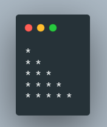                                                                                                                                 | [pattern.c](./phase2/pattern.c)                         |
| 5          | WAP to display the given pattern on the screen  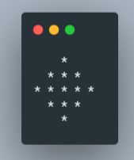                                                                                                                                 | [pattern2.c](./phase2/pattern0.c)                       |
| 6          | WAP to display "WELCOME" on screen  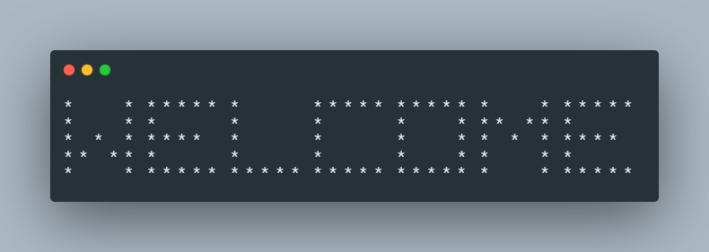                                                                                                                                               | [welcome.c](./phase2/welcome.c)                         |
| 7          | WAP to display "KIIT" on the screen  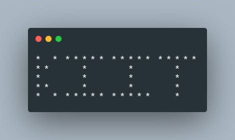                                                                                                                                                 | [kiit.c](./phase2/kiit.c)                               |
| 8          | WAP to perform the arthemetic operations (+,-,\*,/) on two integers and display the result                                                                                                                          | [arithmetic.c](./phase2/arithmetic.c)                   |
| 9          | WAP to find centigrade for a given Fahrenheit temperature                                                                                                                                                           | [temp_conv.c](./phase2/temp_conv.c)                     |
| 10         | WAP to calculate area of a circle                                                                                                                                                                                   | [area_circle.c](./phase2/area_circle.c)                 |
| 11         | WAP to calculate area of triangle                                                                                                                                                                                   | [area_triangle.c](./phase2/area_triangle.c)             |
| 12         | WAP to convert rupee to paisa                                                                                                                                                                                       | [rupee_paisa.c](./phase2/rupee_paisa.c)                 |
| 13         | WAP to convert paisa to rupee                                                                                                                                                                                       | [paisa_rupee.c](./phase2/paisa_rupee.c)                 |
| 14         | WAP to swap two numbers using 3rd variable                                                                                                                                                                          | [swap_third.c](./phase2/swap.c)                         |
| 15         | WAP to swap two numbers without using 3rd variable                                                                                                                                                                  | [swap_nothird.c](./phase2/swap_nothird.c)               |
| 16         | WAP to demonstrate typecasting                                                                                                                                                                                      | [typecasting.c](./phase2/typecasting.c)                 |
| 17         | WAP to perform arithmetic operations on the following :   a, b = user input   c = a + b, c = a - b, c = a \* b, c = a / b, c = a % b                                                                          | [arithmetic.c](./phase2/arithmetic_1.c)                 |
| 18         | WAP to perform bitwise operations on the following :   a = 15, b = 17   c = a & b, c = a \| b, c = a ^ b, c = ~a, c = ~b                                                                                      | [bitwise.c](./phase2/bitwise.c)                         |
| 19         | WAP to perform logical operations on the following:   a = 16, b = 35, c = 0   d = a && b, d = a && c, d = a \| \| c, d = b \| \| c, d = c \| \| c, c = c && c                                                 | [logical.c](./phase2/logical.c)                         |
| 20         | WAP to initialise an integer variable, and display it using all possible format specifiers                                                                                                                          | [integer.c](./phase2/integer.c)                         |
| 21         | WAP to input a number and display in opposite sign                                                                                                                                                                  | [sign.c](./phase2/sign.c)                               |
| 22         | WAP to input radius of circle and calculate its area and circumference                                                                                                                                              | [circle.c](./phase2/circle.c)                           |
| 23         | WAP to input lenght and breadth of rectangle and calculate its area and perimeter                                                                                                                                   | [rectangle.c](./phase2/rectangle.c)                     |
| 24         | WAP to input base and height of a triangle and find its area                                                                                                                                                        | [triangle_2.c](./phase2/triangle_2.c)                   |
| 25         | WAP to input three sides of a traingle and find its area and perimeter                                                                                                                                              | [triangle_3.c](./phase2/triangle_3.c)                   |
| 26         | WAP to input temperature in fahrenheit and display it in celcius                                                                                                                                                    | [feh_cel.c](./phase2/fah_cel.c)                         |
| 27         | WAP to input temperature in celcius and display it in fahnrenheit                                                                                                                                                   | [cel_fah.c](./phase2/cel_fah.c)                         |
| 28         | WAP to input price of a pen in form of rupee and paisa and display it in paisa                                                                                                                                      | [paisa.c](./phase2/paisa.c)                             |
| 29         | WAP to input price of a pen in form of paisa and display it in rupee and pasia                                                                                                                                      | [rupee.c](./phase2/rupee.c)                             |
| 30         | WAP to input the price of a pen and pencil in form of rupee and paisa and add them both                                                                                                                             | [pen_pencil.c](./phase2/pen_pencil.c)                   |
| 31         | WAP to find the difference of two price entered                                                                                                                                                                     | [money_sub.c](./phase2/money_sub.c)                     |
| 32         | WAP to find the roots of the quadratic equation                                                                                                                                                                     | [quadratic.c](./phase2/quadratic.c)                     |
| 33         | WAP to swap two variables without using third variable and addition and subtraction                                                                                                                                 | [swap_noAdd.c](./phase2/swap_noAdd.c)                   |
| 34         | WAP to swap two variables without using third variable and arithmetic operators                                                                                                                                     | [swap_noArithmetic.c](./phase2/swap_noArithmetic.c)     |
| 35         | WAP to find size of data type, variable, and value for all data types                                                                                                                                               | [sizeof.c](./phase2/sizeof.c)                           |
| 36         | WAP to use Prefix and Postfix Operators                                                                                                                                                                             | [post_pre.c](./phase2/post_pre.c)                       |
| 37         | WAP to test assignment operators                                                                                                                                                                                    | [shorthand.c](./phase2/shorthand.c)                     |
| 38         | WAP to use conditional operators                                                                                                                                                                                    | [ternary.c](./phase2/ternary.c)                         |
| 39         | WAP to use comma operators                                                                                                                                                                                          | [comma.c](./phase2/comma.c)                             |
| 40         | WAP to demonstrate the associativity of operators                                                                                                                                                                   | [associativity.c](./phase2/associativity.c)             |
| 41         | WAP to demonstrate the use of type conversion                                                                                                                                                                       | [type_conv.c](./phase2/type_conv.c)                     |
| 42         | WAP to convert given seconds to equivalent hour, minute and seconds                                                                                                                                                 | [time_conv.c](./phase2/time_conv.c)                     |
| 43         | WAP to add two given time                                                                                                                                                                                           | [time_add.c](./phase2/time_add.c)                       |
| 44         | WAP to print the largest among numbers                                                                                                                                                                              | [max_3.c](./phase2/max_3.c)                             |
| 45         | WAP to check if a number given by the user is 0 (zero), positive or negative                                                                                                                                        | [num_chk.c](./phase2/num_chk.c)                         |
| 46         | WAP to check if a number is odd or even                                                                                                                                                                             | [odd_even.c](./phase2/odd_even.c)                       |
| 47         | WAP to print the largest among numbers using nested IF                                                                                                                                                              | [max_3_n.c](./phase2/max_3_n.c)                         |
| 48         | WAP to read an alphabet from the user and convert it into upppercase if the entered alphabet is in lowercase; otherwise disply an appropriate message                                                               | [upper2lower.c](./phase2/upper2lower.c)                 |
| 49         | WAP to check if the entered alphabet is vowel or consonant                                                                                                                                                          | [ckh_voweloconso.c](./phase2/chk_voweloconso.c)         |
| 50         | WAP to determine whether a year entered through the keyboard is leap year or not                                                                                                                                    | [leap_year.c](./phase2/leap_year.c)                     |
| 51         | WAP using if else to create KIIT grade system  90 - 100 : 'O' grade  80 - 89 : 'E' grade 70 - 79 : 'A' grade 60 - 69 : 'B' grade 50 - 59 : 'C' grade 40 - 49 : 'D' grade  below 40 : 'F' grade | [KIIT_grade.c](./phase2/KIIT_grade.c)                   |
| 52         | WAP to find the roots of a quadratic equation ax2 + bx + c = 0 using if else statement                                                                                                                   | [quadratic.c](./phase2/quadratic_1.c)                   |
| 53         | WAP using switch case to create KIIT grade system                                                                                                                                                                   | [KIIT_grade.c](./phase2/KIIT_grade_1.c)                 |
| 54         | WAP using while to print numbers 1 to 5                                                                                                                                                                             | [1to5.c](./phase2/1to5.c)                               |
| 55         | WAP using while loop to print multiplication table                                                                                                                                                                  | [mul_table.c](./phase2/mul_table.c)                     |
| 56         | WAP using while loop to find even numbers between a given range                                                                                                                                                     | [even_range.c](./phase2/even_range.c)                   |
| 57         | WAP using while loop to find sum of digits of a number                                                                                                                                                              | [sumOdigit.c](./phase2/sumOdigit.c)                     |
| 58         | WAP using while loop to find reverse of a number                                                                                                                                                                    | [reverse.c](./phase2/reverse.c)                         |
| 59         | WAP to print numbers in words                                                                                                                                                                                       | [words.c](./phase2/words.c)                             |
| 60         | WAP to print numbers from 1 to 10 using for loop                                                                                                                                                                    | [1to10.c](./phase2/1to10.c)                             |
| 61         | WAP to find the sum of digits for an entered number                                                                                                                                                                 | [sumOdigit.c](./phase2/sumOdigit_1.c)                   |
| 62         | WAP to print all odd numbers in a given range                                                                                                                                                                       | [range_odd.c](./phase2/range_odd.c)                     |
| 63         | WAP to find factors a positive integer                                                                                                                                                                              | [factors.c](./phase2/factors.c)                         |
| 64         | WAP to check whether a number is prime or not                                                                                                                                                                       | [prime.c](./phase2/prime.c)                             |
| 65         | WAP to find the GCD/ HCF of two numbers                                                                                                                                                                             | [gcd.c](./phase2/gcd.c)                                 |
| 66         | WAP to print fibonacci series up to n number of terms                                                                                                                                                               | [fibonacci.c](./phase2/fibonacci.c)                     |
| 67         | WAP to add numbers until the user prints 0 (zero)                                                                                                                                                                   | [untilZero.c](./phase2/untilZero.c)                     |
| 68         | WAP to show the use of `GOTO` keyword                                                                                                                                                                               | [goto.c](./phase2/goto.c)                               |
| 69         | WAP to show the use of `break` statement                                                                                                                                                                            | [break.c](./phase2/break.c)                             |
| 70         | WAP to show the use of `continue` statement                                                                                                                                                                         | [continue.c](./phase2/continue.c)                       |
| 71         | WAP using do while loop to print numbers 10 to 20                                                                                                                                                                   | [10to20.c](./phase2/10to20.c)                           |
| 72         | 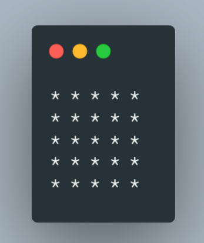                                                                                                                                                                                    | [pattern1.c](./phase2/pattern1.c)                       |
| 73         | 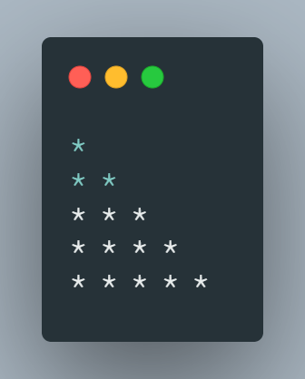                                                                                                                                                                                    | [pattern2.c](./phase2/pattern2.c)                       |
| 74         | 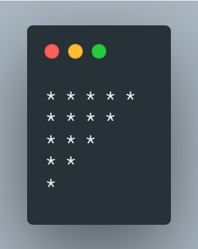                                                                                                                                                                                    | [pattern3.c](./phase2/pattern3.c)                       |
| 75         | 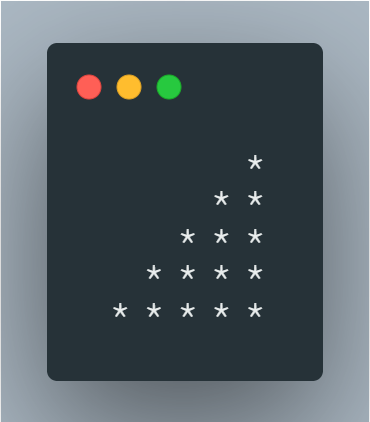                                                                                                                                                                                    | [pattern4.c](./phase2/pattern4.c)                       |
| 76         | 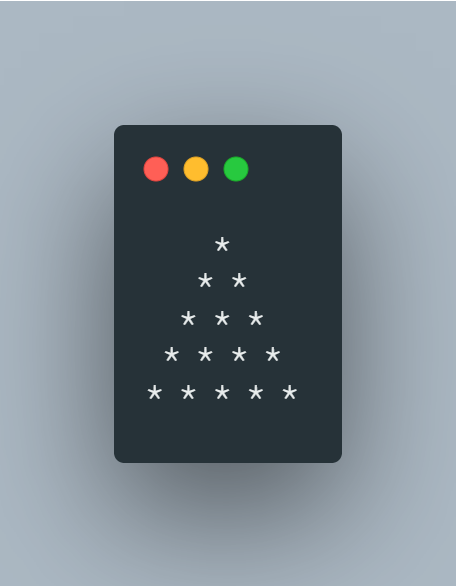                                                                                                                                                                                    | [pattern5.c](./phase2/pattern5.c)                       |
| 77         | 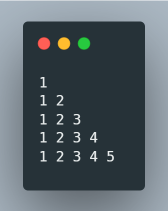                                                                                                                                                                                    | [pattern6.c](./phase2/pattern6.c)                       |
| 78         | 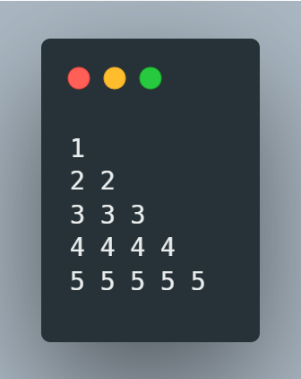                                                                                                                                                                                    | [pattern7.c](./phase2/pattern7.c)                       |
| 79         | 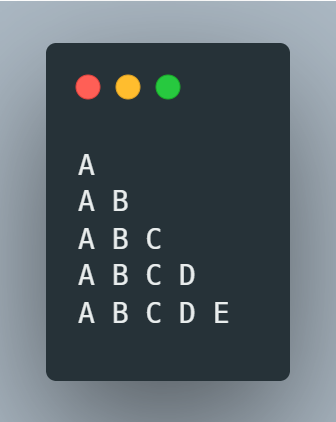                                                                                                                                                                                    | [pattern8.c](./phase2/pattern8.c)                       |
| 80         | 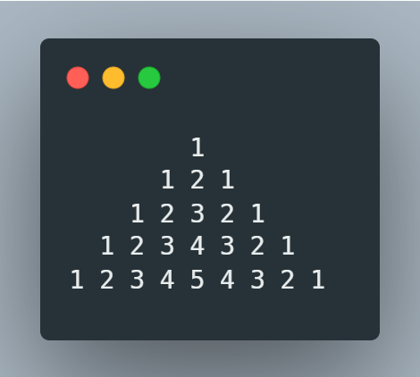                                                                                                                                                                                    | [pattern9.c](./phase2/pattern9.c)                       |
| 81         | 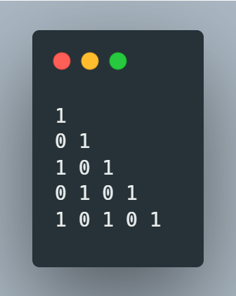                                                                                                                                                                                    | [pattern10.c](./phase2/pattern10.c)                     |
| 82         | 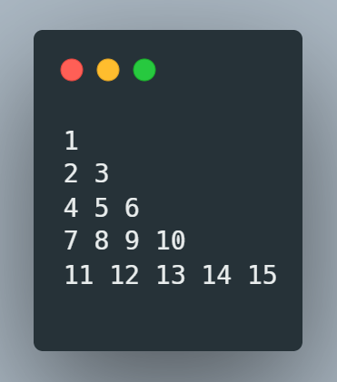                                                                                                                                                                                    | [pattern11.c](./phase2/pattern11.c)                     |
| 83         | WAP to convert hexadecimal to decimal                                                                                                                                                                               | [hex2dec.c](./phase2/hex2dec.c)                         |
| 84         | WAP to convert hexadecimal to binary                                                                                                                                                                                | [hex2bin.c](./phase2/hex2bin.c)                         |
| 85         | WAP to convert octal to binary                                                                                                                                                                                      | [oct2bin.c](./phase2/oct2bin.c)                         |
| 86         | WAP to input a floating point number and check it with 4.6                                                                                                                                                          | [float_chk.c](./phase2/float_chk.c)                     |
| 87         | WAP to print values stored in an array                                                                                                                                                                              | [array_print.c](./phase2/array_print.c)                 |
| 88         | WAP to store values in an array which increaments by 1 and starts from 100                                                                                                                                          | [array_dif1.c](./phase2/array_dif1.c)                   |
| 89         | WAP to swap values between two arrays                                                                                                                                                                               | [array_swap.c](./phase2/array_swap.c)                   |
| 90         | Find average of numbers entered in an array                                                                                                                                                                         | [array_avg.c](./phase2/array_avg.c)                     |
| 91         | WAP to print the number entered by the user in reverse order                                                                                                                                                        | [reverse_num_print.c](./phase2/reverse_num_print.c)     |
| 92         | WAP to print all odd numbers from an array                                                                                                                                                                          | [odd_array.c](./phase2/odd_array.c)                     |
| 93         | WAP to find the largest element stored in an array                                                                                                                                                                  | [array_largest.c](./phase2/array_largest.c)             |
| 94         | WAP to find the second largest element stored in an array                                                                                                                                                           | [array_2_largest.c](./phase2/array_2_largest.c)         |
| 95         | WAP to initialize an array and reverse it                                                                                                                                                                           | [array_reverse.c](./phase2/array_reverse.c)             |
| 96         | Rotate the elements of an array clockwise by 1 position                                                                                                                                                             | [array_cw_1.c](./phase2/array_cw_1.c)                   |
| 97         | Rotate the elements of an array anti-clockwise by n position                                                                                                                                                        | [array_acw_n.c](./phase2/array_acw_n.c)                 |
| 98         | Initialize an array. Divide it in pairs of 3. Add the 3 terms and store it in place of 2nd term.                                                                                                                    | [array_combine.c](./phase2/array_combine.c)             |
| 99         | Replace each element of an array by its factorial                                                                                                                                                                   | [array_fact_replace.c](./phase2/array_fact_replace.c)   |
| 100        | WAP to take input and display a 2D array                                                                                                                                                                            | [2DA.c](./phase2/2DA.c)                                 |
| 101        | WAP to perform addition of all elements present inside a 2DA                                                                                                                                                        | [2DA_add.c](./phase2/2DA_add.c)                         |
| 102        | WAP to display only diagonal elements                                                                                                                                                                               | [2DA_diagonal.c](./phase2/2DA_diagonal.c)               |
| 103        | WAP to display transpose of a matrix                                                                                                                                                                                | [transpose.c](./phase2/transpose.c)                     |
| 104        | WAP to perform addition / subtraction of two 2D arrays                                                                                                                                                              | [2DA_add_sub.c](./phase2/2DA_add_sub.c)                 |
| 105        | WAP to display largest element from the matrix                                                                                                                                                                      | [largest.c](./phase2/largest.c)                         |
| 106        | WAP to display smallest element in each row                                                                                                                                                                         | [smallest_row.c](./phase2/smallest_row.c)               |
| 107        | WAP to display smallest element in each column                                                                                                                                                                      | [largest_column.c](./phase2/largest_column.c)           |
| 108        | WAP to generate a random number between 100 to 200                                                                                                                                                                  | [random.c](./phase2/random.c)                           |
| 109        | WAP to delete all duplicate values in a 1D array                                                                                                                                                                    | [del_duplicate.c](./phase2/del_duplicate.c)             |
| 110        | WAP to input a number and display its nearest higher prime number                                                                                                                                                   | [near_high_prime.c](./phase2/near_high_prime.c)         |
| 111        | WAP to find the determinant of matrix                                                                                                                                                                               | [determinant.c](./phase2/determinant.c)                 |
| 112        | WAP to generate random number between 10 and 15 in an array and replace all prime number with its nearest lowest prime number and replace all composite number with their factorial                                 | [random_array.c](./phase2/random_array.c)               |
| 113        | WAP to initialize a square matrix of users choice with random number then rotate the side elements clockwise and anticlockwise on user choice                                                                       | [CW_ACW_array.c](./phase2/CW_ACW_array.c)               |
| 114        | WAP to populate an array with some random numbers and arrange even elements and odd elements separately (Odd : beginning, Even : end)                                                                               | [arrange_odd_even.c](./phase2/arrange_odd_even.c)       |
| 115        | WAP to populate an arary with some random number and sort the first half in descending order and seond half in ascending order                                                                                      | [sort_half.c](./phase2/sort_half.c)                     |
| 116        | WAP to search an element within an array                                                                                                                                                                            | [search.c](./phase2/search.c)                           |
| 117        | WAP to take a string array and print it                                                                                                                                                                             | [string.c](./phase2/string.c)                           |
| 118        | WAP to check if a character is in uppercase or lower case                                                                                                                                                           | [chkUpper.c](./phase2/chkupper.c)                       |
| 119        | WAP to find the length of a string array                                                                                                                                                                            | [strlen.c](./phase2/strlen.c)                           |
| 120        | WAP to copy one string to another                                                                                                                                                                                   | [strcpy.c](./phase2/strcpy.c)                           |
| 121        | WAP to check if two strings are similar                                                                                                                                                                             | [strcmp.c](./phase2/strcmp.c)                           |
| 122        | WAP to reverse a string                                                                                                                                                                                             | [strrev.c](./phase2/strrev.c)                           |
| 123        | WAP to enter a string an count the number of words                                                                                                                                                                  | [count_words.c](./phase2/count_words.c)                 |
| 124        | WAP to input a string and check whether it is palindrome or not                                                                                                                                                     | [palindrome.c](./phase2/palindrome.c)                   |
| 125        | WAP to input a string and display only the nth word                                                                                                                                                                 | [nth_word.c](./phase2/nth_word.c)                       |
| 126        | WAP to input a string and display it in uppercase, lowercase, sentence case, proper case, toggle case                                                                                                               | [string_cases.c](./phase2/string_case.c)                |
| 127        | WAP to input a name and display in short form. Ex. John Doe -> J. Doe                                                                                                                                               | [short_name.c](./phase2/short_name.c)                   |
| 128        | WAP to input a string and reverse each word in its place                                                                                                                                                            | [reverse_word.c](./phase2/reverse_word.c)               |
| 129        | WAP to find maximum of two numbers using Functions.                                                                                                                                                                 | [max_2.c](./phase2/max_2.c)                             |
| 130        | WAP to find factorial of a number using Functions.                                                                                                                                                                  | [factorial.c](./phase2/factorial.c)                     |
| 131        | WAP to swap two numbers using Functions                                                                                                                                                                             | [swap.c](./phase2/swap_1.c)                             |
| 132        | WAP to find out nth term of the Fibonacci sequence                                                                                                                                                                  | [fibonacci.c](./phase2/fibonacci_1.c)                   |
| 133        | WAP to find the sum of digits using functions.                                                                                                                                                                      | [sum.c](./phase2/sum.c)                                 |
| 134        | WAP to calculate the sum of all the integers stored in the array.                                                                                                                                                   | [array_sum.c](./phase2/array_sum.c)                     |
| 135        | WAP to search an element within an array using functions.                                                                                                                                                           | [search.c](./phase2/search_1.c)                         |
| 136        | WAP to sort elements in ascending order within an array using sort user defined function.                                                                                                                           | [sort.c](./phase2/sort.c)                               |
| 137        | WAP to calculate GCD/HCF using functions.                                                                                                                                                                           | [hcf.c](./phase2/hcf.c)                                 |
| 138        | WAP to check if a given number is Fibonacci number?                                                                                                                                                                 | [chk_fibo.c](./phase2/chk_fibo.c)                       |
| 139        | Sum of natural numbers using recursion.                                                                                                                                                                             | [sum_recursion.c](./phase2/sum_recursion.c)             |
| 140        | Factorial of a number using recursion.                                                                                                                                                                              | [factorial_recursion.c](./phase2/factorial_recursion.c) |
| 141        | GCD/HCF using recursion.                                                                                                                                                                                            | [gcd_recursion.c](./phase2/gcd_recursion.c)             |
| 142        | Count digits of a number using recursion.                                                                                                                                                                           | [count_recursion.c](./phase2/count_recusrion.c)         |
| 143        | Print Sum of Even Numbers in Array using Recursion                                                                                                                                                                  | [sum_even_recursion.c](./phase2/sum_even_recursion.c)   |
| 144        | Find nth term in Fibonacci series                                                                                                                                                                                   | [nth_fibo.c](./phase2/nth_fibo.c)                       |
| 145        | WAP to show the use of pointers on intergers                                                                                                                                                                        | [pointer.c](./phase2/pointer.c)                         |
| 146        | WAP to show the use of pointers on integer array                                                                                                                                                                    | [pointer_array.c](./phase2/pointer_array.c)             |
| 147        | WAP to show the use of pointers on character array                                                                                                                                                                  | [pointer_char_array.c](./phase2/pointer_char_array.c)   |
| 148        | WAP to perform addition of two numbers using pointer                                                                                                                                                                | [pointer_add.c](./phase2/pointer_add.c)                 |
| 149        | WAP to perform swapping of two numbers using pointers                                                                                                                                                               | [pointer_swap.c](./phase2/pointer_swap.c)               |
| 150        | WAP to print reverse of an array using pointers                                                                                                                                                                     | [pointer_reverse.c](./phase2/pointer_reverse.c)         |
| 151        | WAP to sort the numbers of an array using pointers                                                                                                                                                                  | [pointer_sort.c](./phase2/pointer_sort.c)               |
| 152        | WAP to print the sum of natural numbers using pointer array                                                                                                                                                         | [pointer_sumNatural.c](./phase2/pointer_sumNatural.c)   |
| 153        | WAP to show the use of two level pointers                                                                                                                                                                           | [pointer_double.c](./phase2/pointer_double.c)           |
| 154        | WAP to show the use of three level pointers                                                                                                                                                                         | [pointer_triple.c](./phase2/pointer_triple.c)           |
| 155        | 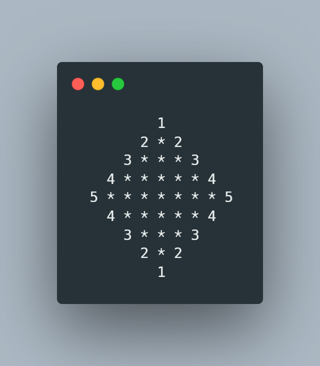                                                                                                                                                                              | [stoopid_pattern.c](./phase2/stoopid_pattern.c)         |
| 156        | WAP to store one student’s information (i.e. student’s roll no, name, gender, marks etc) of an educational institute and display all the data, using structure.                                                     | [uno_stuinfo.c](./phase2/uno_stuinfo.c)                 |
| 157        | WAP to store n student’s information (i.e. student’s roll no, name, gender, marks etc) of an educational institute and display all the data, using array of structure.                                              | [n_stuinfo.c](./phase2/n_stuinfo.c)                     |
| 158        | WAP to add two distances (in inch-feet) using structures.                                                                                                                                                           | [add_distance.c](./phase2/add_distance.c)               |
| 159        | WAP to add two complex numbers by passing structure to a function.                                                                                                                                                  | [add_complex.c](./phase2/add_complex.c)                 |
| 160        | WAP to store n books data such as title, author, publication, price etc using structures. Display all the books information of a particular author.                                                                 | [books_author.c](./phase2/books_author.c)               |
| 161        | WAP to read item details used in party and calculate all expenses, divide expenses in all friends equally.                                                                                                          | [la_fiesta.c](./phase2/la_fiesta.c)                     |
