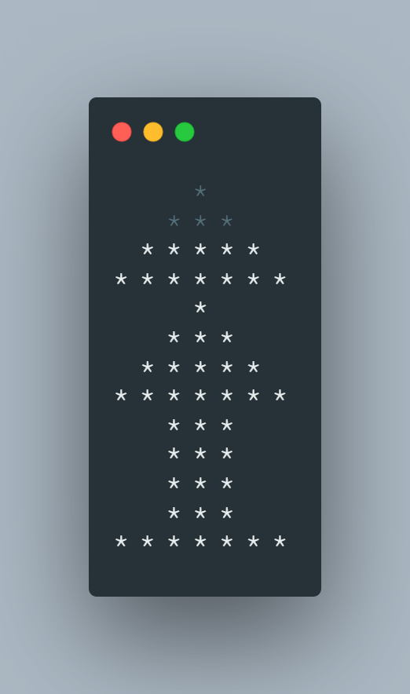

# C-Projects

C is a general-purpose computer programming language.
It was created in the 1970s by Dennis Ritchie, and remains very widely used and influential.
Here, are some of the C programs created by me. And updated regularly. 
You can submit a pull request if you find information missing or incorrect.

## Programs

| **SL NO** | **Program**                                                                                                                                                                                                                                                                                                                                                             | **File**                                                                                                               |
| --------- | ----------------------------------------------------------------------------------------------------------------------------------------------------------------------------------------------------------------------------------------------------------------------------------------------------------------------------------------------------------------------- | ---------------------------------------------------------------------------------------------------------------------- |
| 1         | WAP to print 'Hello World'                                                                                                                                                                                                                                                                                                                                              | [hello_world.c](/data/hello_world.c)                                                                                   |
| 2         | WAP to read and print integer values                                                                                                                                                                                                                                                                                                                                    | [read_print_int.c](/data/read_print_int.c)                                                                             |
| 3         | WAP to add two integer numbers                                                                                                                                                                                                                                                                                                                                          | [addition.c](/data/addition.c)                                                                                         |
| 4         | WAP to print your own name by giving user input                                                                                                                                                                                                                                                                                                                         | [name_user_v1.c](/data/name_user_v1.c), [name_user_v2.c](/data/name_user_v2.c), [name_user_v3.c](/data/name_user_v3.c) |
| 5         | WAP to perform the arithmetic operations ( +, -, \*, /, %) of two integers and display the result.                                                                                                                                                                                                                                                                      | [arithmetic_operations.c](/data/arithmetic_operations.c)                                                               |
| 6         | WAP to convert fahrenheit to centigrade                                                                                                                                                                                                                                                                                                                                 | [temp_conv1.c](/data/temp_conv1.c)                                                                                     |
| 7         | WAP to convert centigrade to fahrenheit                                                                                                                                                                                                                                                                                                                                 | [temp_conv2.c](/data/temp_conv2.c)                                                                                     |
| 8         | WAP to calculate area of a circle                                                                                                                                                                                                                                                                                                                                       | [area_circle.c](/data/area_circle.c)                                                                                   |
| 9         | WAP to calculate area of a triangle                                                                                                                                                                                                                                                                                                                                     | [area_triangle.c](/data/area_triangle.c)                                                                               |
| 10        | WAP to swap two numbers using third variable                                                                                                                                                                                                                                                                                                                            | [swap_third.c](/data/swap_third.c)                                                                                     |
| 11        | WAP to swap two numbers without using third variable                                                                                                                                                                                                                                                                                                                    | [swap_nothird.c](/data/swap_nothird.c)                                                                                 |
| 12        | Convert seconds to hours, minutes and seconds                                                                                                                                                                                                                                                                                                                           | [time_conv.c](/data/time_conv.c)                                                                                       |
| 13        | Convert metres to kilometres and metres                                                                                                                                                                                                                                                                                                                                 | [length_conv.c](/data/length_conv.c)                                                                                   |
| 14        | WAP to calculate simple interest                                                                                                                                                                                                                                                                                                                                        | [si.c](/data/si.c)                                                                                                     |
| 15        | WAP to calculate area of circle, rectangle and square                                                                                                                                                                                                                                                                                                                   | [area.c](/data/area.c)                                                                                                 |
| 16        | WAP to display your name, roll no and branch line wise                                                                                                                                                                                                                                                                                                                  | [name_roll_branch.c](/data/name_roll_branch.c)                                                                         |
| 17        | WAP to accept three subject marks and display their average                                                                                                                                                                                                                                                                                                             | [avg.c](/data/avg.c)                                                                                                   |
| 18        |                                                                                                                                                                                                                                                                                                                                           | [pattern1.c](/data/pattern1.c)                                                                                         |
| 19        | WAP to find maximum and minimum among 4 numbers                                                                                                                                                                                                                                                                                                                         | [max_min_4.c](/data/max_min_4.c)                                                                                       |
| 20        | WAP to calculate area of triangle when all three sides are given                                                                                                                                                                                                                                                                                                        | [area_triangle_3.c](/data/area_triangle_3.c)                                                                           |
| 21        | WAP to find perimeter of a circle                                                                                                                                                                                                                                                                                                                                       | [perimeter_circle.c](/data/perimeter_circle.c)                                                                         |
| 22        | WAP to subtract a number from another number and display its results                                                                                                                                                                                                                                                                                                    | [subtract.c](/data/subtract.c)                                                                                         |
| 23        | WAP to display the size and address of int, float, and char variable                                                                                                                                                                                                                                                                                                    | [address.c](/data/address.c)                                                                                           |
| 24        | Evaluate: p = ++a + a++ + --a                                                                                                                                                                                                                                                                                                                                           | [unary1.c](/data/unary_1.c)                                                                                            |
| 25        | WAP to find the discriminant of the quadratic equation                                                                                                                                                                                                                                                                                                                  | [quadratic.c](/data/quadratic.c)                                                                                       |
| 26        | If p(x) = 2x2 - 5x + 1, then find p(2) and p(3)                                                                                                                                                                                                                                                                                                              | [start_func.c](/data/start_func.c)                                                                                     |
| 27        | WAP to input 3 digit numbers and display the individual digits                                                                                                                                                                                                                                                                                                          | [digits.c](/data/digits.c)                                                                                             |
| 28        | WAP to add two times in hour minute, & second format entered through the keyboard in the format hh:mm:ss                                                                                                                                                                                                                                                                | [time_add.c](/data/time_add.c)                                                                                         |
| 29        | WAP to convert given paisa into its equivalent rupee and paisa as per the following                                                                                                                                                                                                                                                                                     | [pasia_conv.c](/data/paisa_conv.c)                                                                                     |
| 30        | WAP to find the average marks of 5 subjects of a student and find the percentage. Assume full marks of each subject is 100                                                                                                                                                                                                                                              | [avg_percent.c](/data/avg_percent.c)                                                                                   |
| 31        | WAP to enter the principal, time and rate of interest, then calculate compound interest                                                                                                                                                                                                                                                                                 | [ci.c](/data/ci.c)                                                                                                     |
| 32        | WAP to input the basic salary of an employee. From the basic calculate the DA (60% of basic), HRA ( 15% of basic) and Gross salary (Basic + DA + HRA)                                                                                                                                                                                                                   | [salary.c](/data/salary.c)                                                                                             |
| 33        |                                                                                                                                                                                                                                                                                                                                           | [pattern2.c](/data/pattern2.c)                                                                                         |
| 34        | WAP to find the volume of a cube where one side is given                                                                                                                                                                                                                                                                                                                | [vol_cube.c](/data/vol_cube.c)                                                                                         |
| 35        | WAP to find the surface area of a cuboid where length, breadth and height are given                                                                                                                                                                                                                                                                                     | [sa_cuboid.c](/data/sa_cuboid.c)                                                                                       |
| 36        | WAP to input two amount(rupees and paise). Find out the sum of that two amount                                                                                                                                                                                                                                                                                          | [money_add.c](/data/money_add.c)                                                                                       |
| 37        | WAP to input two rational number and find out the sum                                                                                                                                                                                                                                                                                                                   | [add_rational.c](/data/add_rational.c)                                                                                 |
| 38        | WAP to input a 4 digit number and find out the sum of the digits of that number                                                                                                                                                                                                                                                                                         | [sum_digits.c](/data/sum_digits.c)                                                                                     |
| 39        | WAP to determine the roots of a quadratic equation, ax2 + bx + c = 0 using if-else statement                                                                                                                                                                                                                                                                 | [roots_quad.c](/data/roots_quad.c)                                                                                     |
| 40        | WAP to read an alphabet from the user and convert it into uppercase if the entered alphabet is in lowercase otherwise display an apppropriate message                                                                                                                                                                                                                   | [lower_upper.c](/data/lower_upper.c)                                                                                   |
| 41        | WAP to determine wheather a year entered by the user is a leap year or not                                                                                                                                                                                                                                                                                              | [leap_year.c](/data/leap_year.c)                                                                                       |
| 42        | WAP to find the largest among three numbers using ternary operator                                                                                                                                                                                                                                                                                                      | [num_ternary_3.c](/data/num_ternary_3.c)                                                                               |
| 43        | WAP to find the largest among two numbers using ternary operator                                                                                                                                                                                                                                                                                                        | [num_ternary_2.c](/data/num_ternary_2.c)                                                                               |
| 44        | WAP to check wheather a number is odd or even using ternary operator                                                                                                                                                                                                                                                                                                    | [odd_even_ternary.c](/data/odd_even_ternary.c)                                                                         |
| 45        | WAP to display the message 'KIIT Silver Jubliee' if the entered year is 2022 otherwise display 'Wrong Input'                                                                                                                                                                                                                                                            | [kiitsilverjubliee.c](/data/kiitsilverjubliee.c)                                                                       |
| 46        | WAP to read a character from the user and convert it into lowercase alphabet if the entered character is in uppercase and convert it into uppercase if the entered character is in lowercase, otherwise display as it is.                                                                                                                                               | [lower_upper_viceversa.c](/data/lower_upper_viceversa.c)                                                               |
| 47        | WAP to calculate the electric bill by inputting the previous and present meter reading. (The bill amount for 1st 100 units Rs 1.40 per unit, for next 100 units Rs 2.50 per unit and for rest units Rs 3.20 per unit).                                                                                                                                                  | [electric_bill.c](/data/electric_bill.c)                                                                               |
| 48        | WAP to input any two integers, and provide a menu to the user to select any of the options as add, subtract, multiply, divide and display the result accordingly                                                                                                                                                                                                        | [operator_option.c](/data/operator_option.c)                                                                           |
| 49        | WAP to display the grade system of KIIT University based on total marks secured by a student in a semester. Use switch-case statement. Calculate the grade of the student according to the percentage of the mark.                                                                                                                                                      | [grade_switchcase.c](/data/grade_switchcase.c)                                                                         |
| 50        | WAP to display the grade system of KIIT University based on total marks secured by a student in a semester. Use else...if ladder statement.                                                                                                                                                                                                                             | [grade_if_else.c](/data/grade_if_else.c)                                                                               |
| 51        | A shopkeeper sells an article for Rs. 10,000. If the rate of tax under GST is 10%, calculate and display the tax and the amount paid by the customer.                                                                                                                                                                                                                   | [shop_gst.c](/data/shop_gst.c)                                                                                         |
| 52        | A dealer allows his customer two successive discounts of 20% and 10%. If the article costs Rs. 7200, calculate and display the selling price and the total discount given by the dealer.                                                                                                                                                                                | [SP_discount.c](/data/SP_discount.c)                                                                                   |
| 53        | In a competitive examination, there were 150 questions. One candidate got 80% correct and the other candidate 72% correct. WAP to calculate and display the correct answers each candidate got.                                                                                                                                                                         | [marks_competitive.c](/data/marks_competitive.c)                                                                       |
| 54        | WAP to accept the diagonal of a square. Find and display the area and perimeter of the square.                                                                                                                                                                                                                                                                          | [area_square_d.c](/data/area_square_d.c)                                                                               |
| 55        | WAP to accept the number of days and display it after converting into number of years, months and days.                                                                                                                                                                                                                                                                 | [convert_days.c](/data/convert_days.c)                                                                                 |
| 56        | An employee contributes 12% of salary to the Provident fund. Of the remaining salary, he spends 10% on house rent and 20% on education of the children. Write a program to input salary and calculate: i) The amount deducted as provident fund ii) The amount spent on rent and education                                                                        | [salary_division.c](/data/salary_division.c)                                                                           |
| 57        | A two digit number can be obtained by using the expression (10a+b), where a and b are the ten’s and unit’s digits respectively. The number after reversing the digits will be (10b+a). Write a program to input two digits of a number (a and b) and display the result when the sum of number and the reversed number is divided by the difference between its digits. | [reverse_difference.c](/data/reverse_difference.c)                                                                     |
| 58        | Assign a number to all 11 cricket players. Display player number who scored century. Display the player number who scored the highest. Without using loop. And use goto and ?.                                                                                                                                                                                          | [cricket.c](/data/cricket.c)                                                                                           |
| 59        | Bonus == BONUS*RATE * no. of car sold.  Commission = COMMISSION*RATE * no of cars sold \* price Gross salary = BASE_SALARY + Bonus + Commission  MACROS - #define BASE_SALARY = 10000 #define BONUS_RATE = 3000 #define COMISSION_RATE = 0.02                                                                                                         | [salary_commission.c](/data/salary_commission.c)                                                                       |
| 60        | WAP to print Fibonacci Series                                                                                                                                                                                                                                                                                                                                           | [fibonacci.c](/data/fibonacci.c)                                                                                       |
| 61        | WAP to input two amount(rupees and paise). Find out the difference of that two amount                                                                                                                                                                                                                                                                                   | [money_sub.c](/data/money_sub.c)                                                                                       |
| 62        | WAP to print the natural numbers from 1 to 20                                                                                                                                                                                                                                                                                                                           | [one2twen.c](/data/one2twen.c)                                                                                         |
| 63        | WAP to print all numbers within a given range. The range is given by user.                                                                                                                                                                                                                                                                                              | [allnumrange.c](/data/allnumrange.c)                                                                                   |
| 64        | WAP to calculate the factorial of a given number                                                                                                                                                                                                                                                                                                                        | [factorial.c](/data/factorial.c)                                                                                       |
| 65        | WAP to calculate the sum of digits of a given number                                                                                                                                                                                                                                                                                                                    | [sumodigit.c](/data/sumodigit.c)                                                                                       |
| 66        | WAP to find the GCD/HCF and LCM of two given numbers                                                                                                                                                                                                                                                                                                                    | [hcf.c](/data/hcf.c)                                                                                                   |
| 67        | WAP to check whether a number n is prime number or not                                                                                                                                                                                                                                                                                                                  | [prime.c](/data/prime.c)                                                                                               |
| 68        | WAP to check whether an input integer is perfect square or not. (not working)                                                                                                                                                                                                                                                                                           | [perfectsquare.c](/data/perfectsquare.c)                                                                               |
| 69        | WAP to sum the following series S=1+(1+2)+(1+2+3)+...+(1+2+3+...+n)                                                                                                                                                                                                                                                                                                     | [sumseries1.c](/data/sumseries1.c)                                                                                     |
| 70        |                                                                                                                                                                                                                                                                                                                                           | [pattern3.c](/data/pattern3.c)                                                                                         |
| 71        |                                                                                                                                                                                                                                                                                                                                           | [pattern4.c](/data/pattern4.c)                                                                                         |
| 72        |                                                                                                                                                                                                                                                                                                                                           | [pattern5.c](/data/pattern5.c)                                                                                         |
| 73        |                                                                                                                                                                                                                                                                                                                                           | [pattern6.c](/data/pattern6.c)                                                                                         |
| 74        | WAP to generate all the prime numbers between 1 and n, where the value of n is supplied by the user                                                                                                                                                                                                                                                                     | [primen.c](/data/primen.c)                                                                                             |
| 75        | WAP to print all odd and even numbers separately within a given range. The range is input through user                                                                                                                                                                                                                                                                  | [odd_even.c](/data/odd_even.c)                                                                                         |
| 76        | WAP to print the series as 1, 2, 3, 4, 5, 6, 7, .........., n                                                                                                                                                                                                                                                                                                           | [seris1.c](/data/series1.c)                                                                                            |
| 77        | WAP to print the series as 0, 1, 3, 7, 15, 31, .........., n.                                                                                                                                                                                                                                                                                                           | [series2.c](/data/series2.c)                                                                                           |
| 78        | WAP to display the reverse of a number entered through keyboard                                                                                                                                                                                                                                                                                                         | [reverse.c](/data/reverse.c)                                                                                           |
| 79        | WAP to check whether a number is palindrome or not                                                                                                                                                                                                                                                                                                                      | [palindrome.c](/data/palindrome.c)                                                                                     |
| 80        | WAP to print the multiplication table of an entered number                                                                                                                                                                                                                                                                                                              | [mul_table.c](/data/mul_table.c)                                                                                       |
| 81        | WAP to find the sum of the square of first n numbers                                                                                                                                                                                                                                                                                                                    | [square_sum.c](/data/square_sum.c)                                                                                     |
| 82        | WAP to check whether an integer number is a Armstrong number or not                                                                                                                                                                                                                                                                                                     | [armstrong.c](/data/armstrong.c)                                                                                       |
| 83        | WAP to find x to the power of y where x and y will be entered from the keyboard                                                                                                                                                                                                                                                                                         | [power.c](/data/power.c)                                                                                               |
| 84        |                                                                                                                                                                                                                                                                                                                                           | [pattern7.c](/data/pattern7.c)                                                                                         |
| 85        |                                                                                                                                                                                                                                                                                                                                           | [pattern8.c](/data/pattern8.c)                                                                                         |
| 86        | WAP to print a number in letters.                                                                                                                                                                                                                                                                                                                                       | [letter2word.c](/data/letter2word.c)                                                                                   |
| 87        | WAP to calculate sum of the following series: Sum = x\*1/1! + x\*2/2! + x\*4/4! + x\*6/6! + x\*8/8! + x\*10/10!                                                                                                                                                                                                                                                         | [slumseries2.c](/data/sumseries2.c)                                                                                    |
| 88        | WAP to convert a decimal number into its equivalent binary number                                                                                                                                                                                                                                                                                                       | [dec2bin.c](/data/dec2bin.c)                                                                                           |
| 89        | WAP to check whether an input integer is strong number or not                                                                                                                                                                                                                                                                                                           | [strong.c](/data/strong.c)                                                                                             |
| 90        | WAP to find out the prime factors of a number entered through keyboard                                                                                                                                                                                                                                                                                                  | [prime_factors.c](/data/prime_factors.c)                                                                               |
| 91        |                                                                                                                                                                                                                                                                                                                                           | [pattern9.c](/data/pattern9.c)                                                                                         |
| 92        |                                                                                                                                                                                                                                                                                                                                          | [pattern10.c](/data/pattern10.c)                                                                                       |
| 93        |                                                                                                                                                                                                                                                                                                                                          | [pattern11.c](/data/pattern11.c)                                                                                       |
| 94        | WAP to convert a binary number into its equivalent decimal number                                                                                                                                                                                                                                                                                                       | [bin2dec.c](/data/bin2dec.c)                                                                                           |
| 95        | WAP to find the numbers, which are divisible by the sum of its digits                                                                                                                                                                                                                                                                                                   | [divisiblesum.c](/data/divisiblesum.c)                                                                                 |
| 96        | WAP to print numbers between10 to 1000 where the digits of the numbers are equal                                                                                                                                                                                                                                                                                        | [equaldigits.c](/data/equaldigits.c)                                                                                   |
| 97        | WAP to calculate SGPA for a semester                                                                                                                                                                                                                                                                                                                                    | [sgpa.c](./data/sgpa.c)                                                                                                |
| 100       | WAP to declare, initilaize and print a one dimensional array                                                                                                                                                                                                                                                                                                            | [1DC.c](./data/1DA.c)                                                                                                  |
| 101       | WAP to declare, initialize and print a two dimensional array                                                                                                                                                                                                                                                                                                            | [2DA.c](./data/2DA.c)                                                                                                  |
| 102       | WAP to print grade according to KIIT grading system when, 1. Grade is known   2. Marks is known                                                                                                                                                                                                                                                                      | [KIIT_grade.c](./data/KIIT_grade.c), [KIIT_grade_1.c](./data/KIIT_grade_1.c)                                           |
| 103       | WAP to find the sum of digits and the sum of its result until it is a single digit number                                                                                                                                                                                                                                                                               | [sumOdigit_1.c](./data/sumOdigit_1.c)                                                                                  |
| 104       | WAP to print the series: 1, 3, 5, 7, ... n                                                                                                                                                                                                                                                                                                                              | [series3.c](./data/series3.c)                                                                                          |
| 105       | WAP to print the series: 1, 2, 4, ....., n                                                                                                                                                                                                                                                                                                                              | [series4.c](./data/series4.c)                                                                                          |
| 106       | WAP to print the series: 0, 1, 3, 7, ... n                                                                                                                                                                                                                                                                                                                              | [series5.c](./data/series5.c)                                                                                          |
| 107       | WAP to print the series: 1, 2, 3, ,5, 7, ... n                                                                                                                                                                                                                                                                                                                          | [series6.c](./data/series6.c)                                                                                          |
| 108       | WAP to print the series: 1, 2, 4, 7, 11, 16, 22, ... n                                                                                                                                                                                                                                                                                                                  | [series7.c](./data/series7.c)                                                                                          |
| 109       |                                                                                                                                                                                                                                                                                                                                         | [pattern12.c](./data/pattern12.c)                                                                                      |
| 110       | WAP to convert decimal to binary and vice versa                                                                                                                                                                                                                                                                                                                         | [dec2bin.c](./data/dec2bin.c), [bin2dec.c](./data/bin2dec.c)                                                           |
| 111       | WAP to convert decimal to hexadecimal and vice versa                                                                                                                                                                                                                                                                                                                    | [hex2dec.c](./data/hex2dec.c) , [dec2hex.c](./data/dec2hex.c)                                                          |
| 112       | WAP to convert decimal to octal and vice versa                                                                                                                                                                                                                                                                                                                          | [oct2dec.c](./data/oct2dec.c) , [dec2oct.c](./data/dec2oct.c)                                                          |
| 113       | WAP to print a spiral matix                                                                                                                                                                                                                                                                                                                                             | [spiral.c](./data/spiral.js)                                                                                           |
