# Index

This file provides for the index of all C programs taught in class with the dates and Week. 
You can submit a pull request if you find information missing or incorrect.

## 1. Timeline - 8th Feb

| Sl No. | Topic                                                                              | Program                                  |
| ------ | ---------------------------------------------------------------------------------- | ---------------------------------------- |
| 1      | Basic linux commands and their functions                                           | [linux.md](./Feb08/linux.md)             |
| 2      | WAP to display "HELLO WORLD" on screen                                             | [hello.c](./Feb08/hello.c)               |
| 3      | WAP to display your personal info using C program                                  | [personalinfo.c](./Feb08/personalinfo.c) |
| 4      | WAP to display the given pattern on the screen  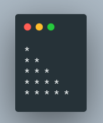  | [pattern.c](./Feb08/pattern.c)           |
| 5      | WAP to display the given pattern on the screen  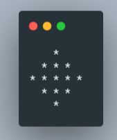 | [pattern2.c](./Feb08/pattern0.c)         |
| 6      | WAP to display "WELCOME" on screen                | [welcome.c](./Feb08/welcome.c)           |
| 7      | WAP to display "KIIT" on the screen                  | [kiit.c](./Feb08/kiit.c)                 |

## 2. Timeline - 15th Feb

| Sl No. | Topic                                                                                      | Program                                    |
| ------ | ------------------------------------------------------------------------------------------ | ------------------------------------------ |
| 1      | WAP to perform the arthemetic operations (+,-,\*,/) on two integers and display the result | [arithmetic.c](./Feb15/arithmetic.c)       |
| 2      | WAP to find centigrade for a given Fahrenheit temperature                                  | [temp_conv.c](./Feb15/temp_conv.c)         |
| 3      | WAP to calculate area of a circle                                                          | [area_circle.c](./Feb15/area_circle.c)     |
| 4      | WAP to calculate area of triangle                                                          | [area_triangle.c](./Feb15/area_triangle.c) |

## 3. Timeline - 22nd Feb

| Sl No. | Topic                                              | Program                                  |
| ------ | -------------------------------------------------- | ---------------------------------------- |
| 1      | WAP to convert rupee to paisa                      | [rupee_paisa.c](./Feb22/rupee_paisa.c)   |
| 2      | WAP to convert paisa to rupee                      | [paisa_rupee.c](./Feb22/paisa_rupee.c)   |
| 3      | WAP to swap two numbers using 3rd variable         | [swap_third.c](./Feb22/swap.c)           |
| 4      | WAP to swap two numbers without using 3rd variable | [swap_nothird.c](./Feb22/swap_nothird.c) |
| 5      | WAP to demonstrate typecasting                     | [typecasting.c](./Feb22/typecasting.c)   |
| 6      | WAP for pre-fix and post-fix                       | [pre_post.c](./Feb22/pre_post_fix.c)     |

## 4. Timeline - 1st Mar

| Sl No. | Topic                                                                                                                                                               | Program                              |
| ------ | ------------------------------------------------------------------------------------------------------------------------------------------------------------------- | ------------------------------------ |
| 1      | WAP to perform arithmetic operations on the following :   a, b = user input   c = a + b, c = a - b, c = a \* b, c = a / b, c = a % b                          | [arithmetic.c](./Mar01/arithmetic.c) |
| 2      | WAP to perform bitwise operations on the following :   a = 15, b = 17   c = a & b, c = a \| b, c = a ^ b, c = ~a, c = ~b                                      | [bitwise.c](./Mar01/bitwise.c)       |
| 3      | WAP to perform logical operations on the following:   a = 16, b = 35, c = 0   d = a && b, d = a && c, d = a \| \| c, d = b \| \| c, d = c \| \| c, c = c && c | [logical.c](./Mar01/logical.c)       |

## 5. Timeline - 3rd March

| Sl No. | Topic                                                                                      | Program                              |
| ------ | ------------------------------------------------------------------------------------------ | ------------------------------------ |
| 1      | WAP to initialise an integer variable, and display it using all possible format specifiers | [integer.c](./Mar03/integer.c)       |
| 2      | WAP to input a number and display in opposite sign                                         | [sign.c](./Mar03/sign.c)             |
| 3      | WAP to input radius of circle and calculate its area and circumference                     | [circle.c](./Mar03/circle.c)         |
| 4      | WAP to input lenght and breadth of rectangle and calculate its area and perimeter          | [rectangle.c](./Mar03/rectangle.c)   |
| 5      | WAP to input base and height of a triangle and find its area                               | [triangle_2.c](./Mar03/triangle_2.c) |
| 6      | WAP to input three sides of a traingle and find its area and perimeter                     | [triangle_3.c](./Mar03/triangle_3.c) |
| 7      | WAP to input temperature in fahrenheit and display it in celcius                           | [feh_cel.c](./Mar03/fah_cel.c)       |
| 8      | WAP to input temperature in celcius and display it in fahnrenheit                          | [cel_fah.c](./Mar03/cel_fah.c)       |
| 9      | WAP to input price of a pen in form of rupee and paisa and display it in paisa             | [paisa.c](./Mar03/paisa.c)           |
| 10     | WAP to input price of a pen in form of paisa and display it in rupee and pasia             | [rupee.c](./Mar03/rupee.c)           |
| 11     | WAP to input the price of a pen and pencil in form of rupee and paisa and add them both    | [pen_pencil.c](./Mar03/pen_pencil.c) |

## 6. Timeline - 10th March

| Sl No. | Topic                                                                               | Program                                            |
| ------ | ----------------------------------------------------------------------------------- | -------------------------------------------------- |
| 1      | WAP to find the difference of two price entered                                     | [money_sub.c](./Mar10/money_sub.c)                 |
| 2      | WAP to find the roots of the quadratic equation                                     | [quadratic.c](./Mar10/quadratic.c)                 |
| 3      | WAP to swap two variables without using third variable and addition and subtraction | [swap_noAdd.c](./Mar10/swap_noAdd.c)               |
| 4      | WAP to swap two variables without using third variable and arithmetic operators     | [swap_noArithmetic.c](./Mar10/swap_noArithmetic.c) |
| 5      | WAP to find size of data type, variable, and value for all data types               | [sizeof.c](./Mar10/sizeof.c)                       |

## 7. Timeline - 15th Mar

| Sl No. | Topic                                   | Program                            |
| ------ | --------------------------------------- | ---------------------------------- |
| 1      | WAP to use Prefix and Postfix Operators | [post_pre.c](./Mar15/post_pre.c)   |
| 2      | WAP to test assignment operators        | [shorthand.c](./Mar15/shorthand.c) |
| 3      | WAP to use conditional operators        | [ternary.c](./Mar15/ternary.c)     |
| 4      | WAP to use comma operators              | [comma.c](./Mar15/comma.c)         |

## 8. Timeline - 17th Mar

| Sl No. | Topic                                                                        | Program                                    |
| ------ | ---------------------------------------------------------------------------- | ------------------------------------------ |
| 1      | WAP to demonstrate the associativity of operators                            | [associativity.c](./Mar17/associativity.c) |
| 2      | WAP to demonstrate the use of type conversion                                | [type_conv.c](./Mar17/type_conv.c)         |
| 3      | WAP to convert given seconds to equivalent hour, minute and seconds          | [time_conv.c](./Mar17/time_conv.c)         |
| 4      | WAP to add two given time                                                    | [time_add.c](./Mar17/time_add.c)           |
| 5      | WAP to print the largest among numbers                                       | [max_3.c](./Mar17/max_3.c)                 |
| 6      | WAP to check if a number given by the user is 0 (zero), positive or negative | [num_chk.c](./Mar17/num_chk.c)             |
| 7      | WAP to check if a number is odd or even                                      | [odd_even.c](./Mar17/odd_even.c)           |
| 8      | WAP to print the largest among numbers using nested IF                       | [max_3_n.c](./Mar17/max_3_n.c)             |

## 9. Timeline - 22nd Mar

| Sl No. | Topic                                                                                                                                                                                                               | Program                                        |
| ------ | ------------------------------------------------------------------------------------------------------------------------------------------------------------------------------------------------------------------- | ---------------------------------------------- |
| 1.     | WAP to read an alphabet from the user and convert it into upppercase if the entered alphabet is in lowercase; otherwise disply an appropriate message                                                               | [upper2lower.c](./Mar22/upper2lower.c)         |
| 2.     | WAP to check if the entered alphabet is vowel or consonant                                                                                                                                                          | [ckh_voweloconso.c](./Mar22/chk_voweloconso.c) |
| 3.     | WAP to determine whether a year entered through the keyboard is leap year or not                                                                                                                                    | [leap_year.c](./Mar22/leap_year.c)             |
| 4.     | WAP using if else to create KIIT grade system  90 - 100 : 'O' grade  80 - 89 : 'E' grade 70 - 79 : 'A' grade 60 - 69 : 'B' grade 50 - 59 : 'C' grade 40 - 49 : 'D' grade  below 40 : 'F' grade | [KIIT_grade.c](./Mar22/KIIT_grade.c)           |
| 5.     | WAP to find the roots of a quadratic equation ax2 + bx + c = 0 using if else statement                                                                                                                   | [quadratic.c](./Mar22/quadratic.c)             |

## 10. Timeline - 24th Mar

| Sl No. | Topic                                                           | Program                              |
| ------ | --------------------------------------------------------------- | ------------------------------------ |
| 1.     | WAP using switch case to create KIIT grade system               | [KIIT_grade.c](./Mar24/KIIT_grade.c) |
| 2.     | WAP using while to print numbers 1 to 5                         | [1to5.c](./Mar24/1to5.c)             |
| 3.     | WAP using while loop to print multiplication table              | [mul_table.c](./Mar24/mul_table.c)   |
| 4.     | WAP using while loop to find even numbers between a given range | [even_range.c](./Mar24/even_range.c) |
| 5.     | WAP using while loop to find sum of digits of a number          | [sumOdigit.c](./Mar24/sumOdigit.c)   |
| 6.     | WAP using while loop to find reverse of a number                | [reverse.c](./Mar24/reverse.c)       |
| 7.     | WAP to print numbers in words                                   | [words.c](./Mar24/words.c)           |

## 11. Timeline - 29th Mar

| Sl No. | Topic                                                 | Program                            |
| ------ | ----------------------------------------------------- | ---------------------------------- |
| 1.     | WAP to print numbers from 1 to 10 using for loop      | [1to10.c](./Mar29/1to10.c)         |
| 2.     | WAP to find the sum of digits for an entered number   | [sumOdigit.c](./Mar29/sumOdigit.c) |
| 3.     | WAP to print all odd numbers in a given range         | [range_odd.c](./Mar29/range_odd.c) |
| 4.     | WAP to find factors a positive integer                | [factors.c](./Mar29/factors.c)     |
| 5.     | WAP to check whether a number is prime or not         | [prime.c](./Mar29/prime.c)         |
| 6.     | WAP to find the GCD/ HCF of two numbers               | [gcd.c](./Mar29/gcd.c)             |
| 7.     | WAP to print fibonacci series up to n number of terms | [fibonacci.c](./Mar29/fibonacci.c) |
| 8.     | WAP to add numbers until the user prints 0 (zero)     | [untilZero.c](./Mar29/untilZero.c) |

## 12. Timeline - 31st Mar

| Sl No. | Topic                                             | Program                            |
| ------ | ------------------------------------------------- | ---------------------------------- |
| 1.     | WAP to show the use of `GOTO` keyword             | [goto.c](./Mar31/goto.c)           |
| 2.     | WAP to show the use of `break` statement          | [break.c](./Mar31/break.c)         |
| 3.     | WAP to show the use of `continue` statement       | [continue.c](./Mar31/continue.c)   |
| 4.     | WAP using do while loop to print numbers 10 to 20 | [10to20.c](./Mar31/10to20.c)       |
| 5.     |                    | [pattern1.c](./Mar31/pattern1.c)   |
| 6.     |                    | [pattern2.c](./Mar31/pattern2.c)   |
| 7.     | 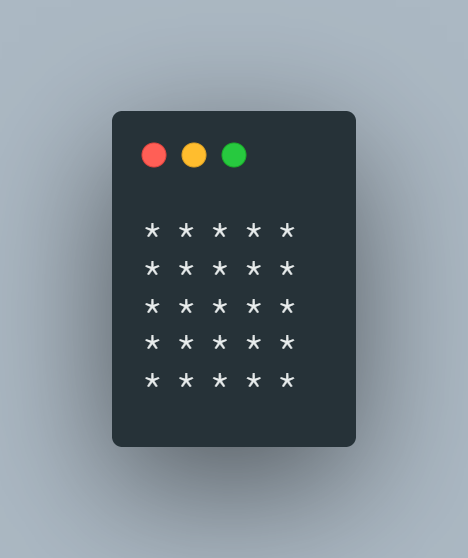                   | [pattern3.c](./Mar31/pattern3.c)   |
| 8.     | 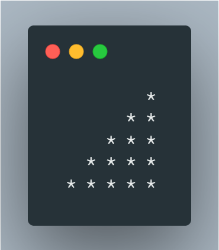                   | [pattern4.c](./Mar31/pattern4.c)   |
| 9.     | 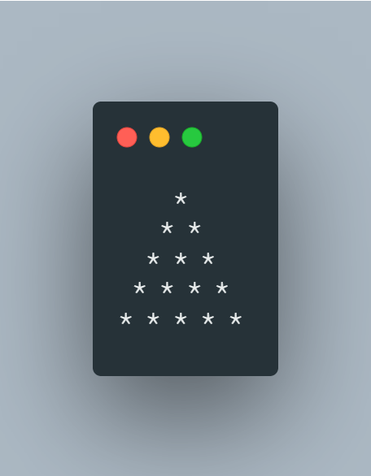                   | [pattern5.c](./Mar31/pattern5.c)   |
| 10.    | 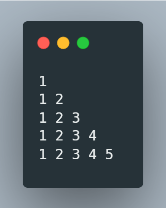                   | [pattern6.c](./Mar31/pattern6.c)   |
| 11.    | 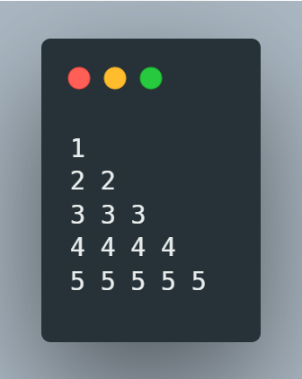                   | [pattern7.c](./Mar31/pattern7.c)   |
| 12.    | 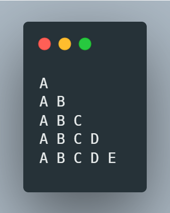                   | [pattern8.c](./Mar31/pattern8.c)   |
| 13.    | 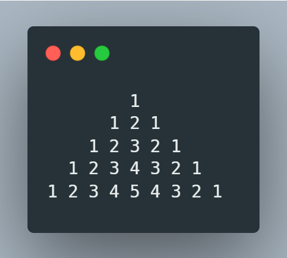                   | [pattern9.c](./Mar31/pattern9.c)   |
| 14.    | 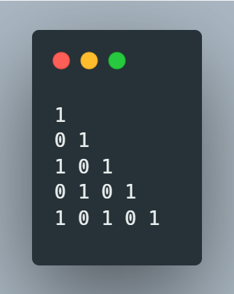                  | [pattern10.c](./Mar31/pattern10.c) |

## 13. Timeline - 12th Apr

| Sl No. | Topic                            | Program                            |
| ------ | -------------------------------- | ---------------------------------- |
| 1.     | 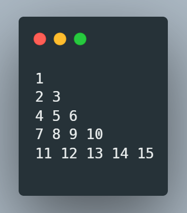 | [pattern11.c](./Apr12/pattern11.c) |

## 14. Timeline - 19 Apr

| Sl No. | Topic                                 | Program                        |
| ------ | ------------------------------------- | ------------------------------ |
| 1.     | WAP to convert hexadecimal to decimal | [hex2dec.c](./Apr19/hex2dec.c) |
| 2.     | WAP to convert hexadecimal to binary  | [hex2bin.c](./Apr19/hex2bin.c) |
| 3.     | WAP to convert octal to binary        | [oct2bin.c](./Apr19/oct2bin.c) |

## 15. Timeline - 21 Apr

| Sl No. | Topic                                                                      | Program                                |
| ------ | -------------------------------------------------------------------------- | -------------------------------------- |
| 1.     | WAP to input a floating point number and check it with 4.6                 | [float_chk.c](./Apr21/float_chk.c)     |
| 2.     | WAP to print values stored in an array                                     | [array_print.c](./Apr21/array_print.c) |
| 3.     | WAP to store values in an array which increaments by 1 and starts from 100 | [array_dif1.c](./Apr21/array_dif1.c)   |
| 4.     | WAP to swap values between two arrays                                      | [array_swap.c](./Apr21/array_swap.c)   |
| 5.     | Find average of numbers entered in an array                                | [array_avg.c](./Apr21/array_avg.c)     |

## 16. Timeline - 26 Apr

| Sl No. | Topic                                                                                            | Program                                              |
| ------ | ------------------------------------------------------------------------------------------------ | ---------------------------------------------------- |
| 1.     | WAP to print the number entered by the user in reverse order                                     | [reverse_num_print.c](./Apr26/reverse_num_print.c)   |
| 2.     | WAP to print all odd numbers from an array                                                       | [odd_array.c](./Apr26/odd_array.c)                   |
| 3.     | WAP to find the largest element stored in an array                                               | [array_largest.c](./Apr26/array_largest.c)           |
| 4.     | WAP to find the second largest element stored in an array                                        | [array_2_largest.c](./Apr26/array_2_largest.c)       |
| 5.     | WAP to program to initialize an array and reverse it                                             | [array_reverse.c](./Apr26/array_reverse.c)           |
| 6.     | Rotate the elements of an array clockwise by 1 position                                          | [array_cw_1.c](./Apr26/array_cw_1.c)                 |
| 7.     | Rotate the elements of an array anti-clockwise by n position                                     | [array_acw_n.c](./Apr26/array_acw_n.c)               |
| 8.     | Initialize an array. Divide it in pairs of 3. Add the 3 terms and store it in place of 2nd term. | [array_combine.c](./Apr26/array_combine.c)           |
| 9.     | Replace each element of an array by its factorial                                                | [array_fact_replace.c](./Apr26/array_fact_replace.c) |

## 17. Timeline - 28 Apr

| Sl No. | Topic                                                        | Program                                               |
| ------ | ------------------------------------------------------------ | ----------------------------------------------------- |
| 1.     | WAP to take input and display a 2D array                     | [2DA.c](./Apr28/2DA.c)                                |
| 2.     | WAP to perform addition of all elements present inside a 2DA | [2DA_add.c](./Apr28/2DA_add.c)                        |
| 3.     | WAP to display only diagonal elements                        | [2DA_diagonal.c](./Apr28/2DA_diagonal.c)              |
| 4.     | WAP to display transpose of a matrix                         | [transpose.c](./Apr28/transpose.c)                    |
| 5.     | WAP to perform addition / subtraction of two 2D arrays       | [2DA_add_sub.c](./Apr28/2DA_add_sub.c)                |
| 6.     | WAP to display largest element from the matrix               | [largest.c](./Apr28/largest.c)                        |
| 7.     | WAP to display smallest element in each row                  | [smallest_row.c](./Apr28/smallest_row.c)              |
| 8.     | WAP to display smallest element in each column               | [largest_column.c](./Apr28/largest_column.c)          |
| 9.     | WAP to generate a random number between 100 to 200           | [random.c](./Apr28/random.c)                          |
| 10.    | WAP to delete all duplicate values in a 1D array             | [del_duplicate.c](./Apr28/del_duplicate.c) <- pending |

## 18. Timeline - 03 May

| Sl No. | Topic                                                                                                                                                                               | Program                                                           |
| ------ | ----------------------------------------------------------------------------------------------------------------------------------------------------------------------------------- | ----------------------------------------------------------------- |
| 1.     | WAP to input a number and display its nearest higher prime number                                                                                                                   | [near_high_prime.c](./May03/near_high_prime.c)                    |
| 2.     | WAP to find the determinant of matrix                                                                                                                                               | [determinant.c](./May03/determinant.c)                            |
| 3.     | WAP to generate random number between 10 and 15 in an array and replace all prime number with its nearest lowest prime number and replace all composite number with their factorial | [random_array.c](./Mar03/random_array.c) <- User Defined function |
