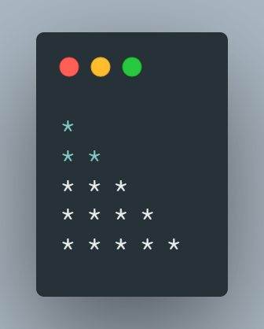

# Index

This file provides for the index of all C programs taught in class with the dates and Week

## 1. Timeline - 8th Feb

| Sl No. | Topic                                                                              | Program                                  |
| ------ | ---------------------------------------------------------------------------------- | ---------------------------------------- |
| 1      | Basic linux commands and their functions                                           | [linux.md](./Feb08/linux.md)             |
| 2      | WAP to display "HELLO WORLD" on screen                                             | [hello.c](./Feb08/hello.c)               |
| 3      | WAP to display your personal info using C program                                  | [personalinfo.c](./Feb08/personalinfo.c) |
| 4      | WAP to display the given pattern on the screen   | [pattern1.c](./Feb08/pattern1.c)         |
| 5      | WAP to display the given pattern on the screen   | [pattern2.c](./Feb08/pattern2.c)         |
| 6      | WAP to display "WELCOME" on screen                | [welcome.c](./Feb08/welcome.c)           |
| 7      | WAP to display "KIIT" on the screen                  | [kiit.c](./Feb08/kiit.c)                 |

## 2. Timeline - 15th Feb

| Sl No. | Topic                                                                                      | Program                                    |
| ------ | ------------------------------------------------------------------------------------------ | ------------------------------------------ |
| 1      | WAP to perform the arthemetic operations (+,-,\*,/) on two integers and display the result | [arithmetic.c](./Feb15/arithmetic.c)       |
| 2      | WAP to find centigrade for a given Fahrenheit temperature                                  | [temp_conv.c](./Feb15/temp_conv.c)         |
| 3      | WAP to calculate area of a circle                                                          | [area_circle.c](./Feb15/area_circle.c)     |
| 4      | WAP to calculate area of triangle                                                          | [area_triangle.c](./Feb15/area_triangle.c) |

## 3. Timeline - 22nd Feb

| Sl No. | Topic                                              | Program                                  |
| ------ | -------------------------------------------------- | ---------------------------------------- |
| 1      | WAP to convert rupee to paisa                      | [rupee_paisa.c](./Feb22/rupee_paisa.c)   |
| 2      | WAP to convert paisa to rupee                      | [paisa_rupee.c](./Feb22/paisa_rupee.c)   |
| 3      | WAP to swap two numbers using 3rd variable         | [swap_third.c](./Feb22/swap.c)           |
| 4      | WAP to swap two numbers without using 3rd variable | [swap_nothird.c](./Feb22/swap_nothird.c) |
| 5      | WAP to demonstrate typecasting                     | [typecasting.c](./Feb22/typecasting.c)   |
| 6      | WAP for pre-fix and post-fix                       | [pre_post.c](./Feb22/pre_post_fix.c)     |

## 4. Timeline - 1st Mar

| Sl No. | Topic                                                                                                                                                               | Program                              |
| ------ | ------------------------------------------------------------------------------------------------------------------------------------------------------------------- | ------------------------------------ |
| 1      | WAP to perform arithmetic operations on the following :   a, b = user input   c = a + b, c = a - b, c = a \* b, c = a / b, c = a % b                          | [arithmetic.c](./Mar01/arithmetic.c) |
| 2      | WAP to perform bitwise operations on the following :   a = 15, b = 17   c = a & b, c = a \| b, c = a ^ b, c = ~a, c = ~b                                      | [bitwise.c](./Mar01/bitwise.c)       |
| 3      | WAP to perform logical operations on the following:   a = 16, b = 35, c = 0   d = a && b, d = a && c, d = a \| \| c, d = b \| \| c, d = c \| \| c, c = c && c | [logical.c](./Mar01/logical.c)       |

## 5. Timeline - 3rd March

| Sl No. | Topic                                                                                      | Program                              |
| ------ | ------------------------------------------------------------------------------------------ | ------------------------------------ |
| 1      | WAP to initialise an integer variable, and display it using all possible format specifiers | [integer.c](./Mar03/integer.c)       |
| 2      | WAP to input a number and display in opposite sign                                         | [sign.c](./Mar03/sign.c)             |
| 3      | WAP to input radius of circle and calculate its area and circumference                     | [circle.c](./Mar03/circle.c)         |
| 4      | WAP to input lenght and breadth of rectangle and calculate its area and perimeter          | [rectangle.c](./Mar03/rectangle.c)   |
| 5      | WAP to input base and height of a triangle and find its area                               | [triangle_2.c](./Mar03/triangle_2.c) |
| 6      | WAP to input three sides of a traingle and find its area and perimeter                     | [triangle_3.c](./Mar03/triangle_3.c) |
| 7      | WAP to input temperature in fahrenheit and display it in celcius                           | [feh_cel.c](./Mar03/fah_cel.c)       |
| 8      | WAP to input temperature in celcius and display it in fahnrenheit                          | [cel_fah.c](./Mar03/cel_fah.c)       |
| 9      | WAP to input price of a pen in form of rupee and paisa and display it in paisa             | [paisa.c](./Mar03/paisa.c)           |
| 10     | WAP to input price of a pen in form of paisa and display it in rupee and pasia             | [rupee.c](./Mar03/rupee.c)           |
| 11     | WAP to input the price of a pen and pencil in form of rupee and paisa and add them both    | [pen_pencil.c](./Mar03/pen_pencil.c) |

## 6. Timeline - 10th March

| Sl No. | Topic                                                                               | Program                                            |
| ------ | ----------------------------------------------------------------------------------- | -------------------------------------------------- |
| 1      | WAP to find the difference of two price entered                                     | [money_sub.c](./Mar10/money_sub.c)                 |
| 2      | WAP to find the roots of the quadratic equation                                     | [quadratic.c](./Mar10/quadratic.c)                 |
| 3      | WAP to swap two variables without using third variable and addition and subtraction | [swap_noAdd.c](./Mar10/swap_noAdd.c)               |
| 4      | WAP to swap two variables without using third variable and arithmetic operators     | [swap_noArithmetic.c](./Mar10/swap_noArithmetic.c) |
| 5      | WAP to find size of data type, variable, and value for all data types               | [sizeof.c](./Mar10/sizeof.c)                       |

## 7. Timeline - 15th Mar

| Sl No. | Topic                                   | Program                            |
| ------ | --------------------------------------- | ---------------------------------- |
| 1      | WAP to use Prefix and Postfix Operators | [post_pre.c](./Mar15/post_pre.c)   |
| 2      | WAP to test assignment operators        | [shorthand.c](./Mar15/shorthand.c) |
| 3      | WAP to use conditional operators        | [ternary.c](./Mar15/ternary.c)     |
| 4      | WAP to use comma operators              | [comma.c](./Mar15/comma.c)         |

## 8. Timeline - 17th Mar

| Sl No. | Topic                                                                        | Program                                    |
| ------ | ---------------------------------------------------------------------------- | ------------------------------------------ |
| 1      | WAP to demonstrate the associativity of operators                            | [associativity.c](./Mar17/associativity.c) |
| 2      | WAP to demonstrate the use of type conversion                                | [type_conv.c](./Mar17/type_conv.c)         |
| 3      | WAP to convert given seconds to equivalent hour, minute and seconds          | [time_conv.c](./Mar17/time_conv.c)         |
| 4      | WAP to add two given time                                                    | [time_add.c](./Mar17/time_add.c)           |
| 5      | WAP to print the largest among numbers                                       | [max_3.c](./Mar17/max_3.c)                 |
| 6      | WAP to check if a number given by the user is 0 (zero), positive or negative | [num_chk.c](./Mar17/num_chk.c)             |
| 7      | WAP to check if a number is odd or even                                      | [odd_even.c](./Mar17/odd_even.c)           |
| 8      | WAP to print the largest among numbers using nested IF                       | [max_3_n.c](./Mar17/max_3_n.c)             |

## 9. Timeline - 22nd Mar

| Sl No. | Topic                                                                                                                                                                                                               | Program                                        |
| ------ | ------------------------------------------------------------------------------------------------------------------------------------------------------------------------------------------------------------------- | ---------------------------------------------- |
| 1.     | WAP to read an alphabet from the user and convert it into upppercase if the entered alphabet is in lowercase; otherwise disply an appropriate message                                                               | [upper2lower.c](./Mar22/upper2lower.c)         |
| 2.     | WAP to check if the entered alphabet is vowel or consonant                                                                                                                                                          | [ckh_voweloconso.c](./Mar22/chk_voweloconso.c) |
| 3.     | WAP to determine whether a year entered through the keyboard is leap year or not                                                                                                                                    | [leap_year.c](./Mar22/leap_year.c)             |
| 4.     | WAP using if else to create KIIT grade system  90 - 100 : 'O' grade  80 - 89 : 'E' grade 70 - 79 : 'A' grade 60 - 69 : 'B' grade 50 - 59 : 'C' grade 40 - 49 : 'D' grade  below 40 : 'F' grade | [KIIT_grade.c](./Mar22/KIIT_grade.c)           |
| 5.     | WAP to find the roots of a quadratic equation ax2 + bx + c = 0 using if else statement                                                                                                                   | [quadratic.c](./Mar22/quadratic.c)             |

## 10. Timeline - 24th Mar

| Sl No. | Topic                                                           | Program                              |
| ------ | --------------------------------------------------------------- | ------------------------------------ |
| 1.     | WAP using switch case to create KIIT grade system               | [KIIT_grade.c](./Mar24/KIIT_grade.c) |
| 2.     | WAP using while to print numbers 1 to 5                         | [1to5.c](./Mar24/1to5.c)             |
| 3.     | WAP using while loop to print multiplication table              | [mul_table.c](./Mar24/mul_table.c)   |
| 4.     | WAP using while loop to find even numbers between a given range | [even_range.c](./Mar24/even_range.c) |
| 5.     | WAP using while loop to find sum of digits of a number          | [sumOdigit.c](./Mar24/sumOdigit.c)   |
| 6.     | WAP using while loop to find reverse of a number                | [reverse.c](./Mar24/reverse.c)       |
| 7.     | WAP to print numbers in words                                   | [words.c](./Mar24/words.c)           |

## 11. Timeline - 29th Mar

| Sl No. | Topic                                              | Program                            |
| ------ | -------------------------------------------------- | ---------------------------------- |
| 1.     | WAP to print numbers from 1 to 10 using for loop   | [1to10.c](./Mar29/1to10.c)         |
| 2.     | WA to find the sum of digits for an entered number | [sumOdigit.c](./Mar29/sumOdigit.c) |
| 3.     | WAP to print all odd numbers in a given range      | [range_odd.c](./Mar29/range_odd.c) |
| 4.     | WAP to find factors a positive integer             | [factors.c](./Mar29/factors.c)     |
| 5.     | WAP to cheeck whether a number is prime or not     | [prime.c](./Mar29/prime.c)         |
